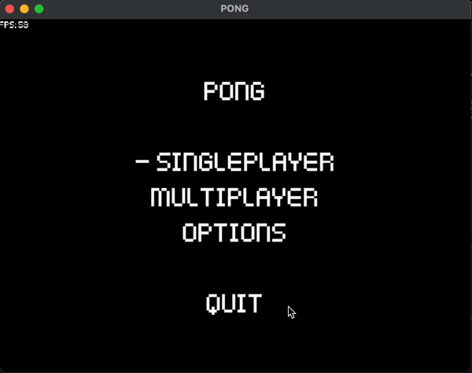

# Retro Pong

## Update
I have dropped this project as I have moved on. Implementing multiplayer was my limit. Messing around with networking, espcially in C++ is something I underestimated.

## Overview
Welcome to **Pong**, a classic singleplayer/multiplayer pong game built with SDL3. Challenge your friends or play against yourself in this timeless arcade game.

## Features
- 🎮 **Multiplayer Mode**: Play with friends locally or on the net!. (SOON!)
- 🕹️ **Single Player Mode**: Challenge yourself!
- 🔄 **Game Options**: Customize your gameplay experience.
- 🖥️ **Fullscreen Toggle**: Switch between fullscreen and windowed mode.




## Getting Started

### Prerequisites
- **SDL3**: Make sure you have SDL3 installed on your system.
- **C++17**: Ensure you have a C++17 compatible compiler.

### Installation
1. **Clone the repository**:
    ```sh
    git clone https://github.com/vict0rfr/pong.git
    cd pong
    ```

2. **Build the project**:
    ```sh
    mkdir build
    cd build
    cmake ..
    make
    ```

3. **Run the game**:
    ```sh
    ./pong
    ```

---

Enjoy playing Pong! 🎉